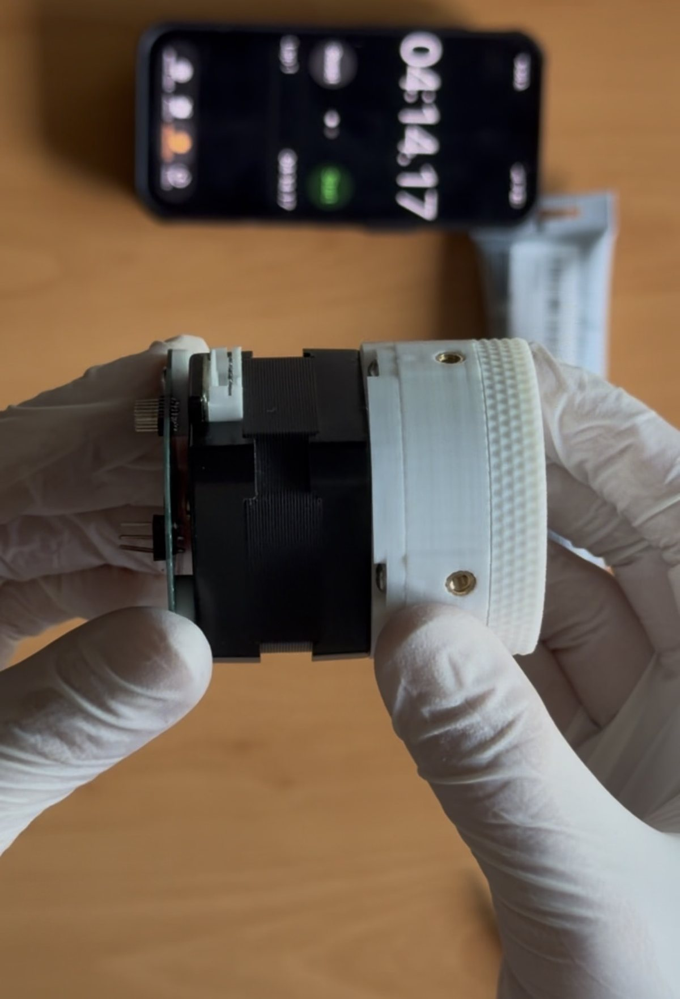

# HDP30: a 3D-printable 30:1 pancake harmonic drive actuator

A strain-wave (harmonic) gearbox that bolts onto a standard NEMA 17 stepper,
prints on a bog-standard bed slinger, and costs about **$4 of hardware** per
unit. Half again the reduction of our [HD20](https://github.com/robrotics/hd17)
in a thinner package, using the same screws, the same bearing and the same
motor face.



| | |
|---|---|
| **Reduction** | 30:1 |
| **Tooth profile** | Cycloidal, module 0.55, 60-tooth flexspline / 62-tooth circular spline |
| **Measured torque** | **not yet measured**, see [Test data](#test-data) |
| **Efficiency** | not yet measured |
| **Backlash** | not yet measured |
| **Motor** | Any NEMA 17 with a 5 mm shaft (same interface plate as the HD20) |
| **Lubrication** | Super Lube synthetic PTFE grease |
| **Printed parts** | 10 pieces across 9 unique parts, including 2 shear pins |
| **Fasteners** | 8 × M3×0.5 × 6 mm button head screws per drive |
| **Hardware cost** | ~$3.96 per actuator |
| **Version** | v1.0 (RevB, 2026-08-30) |
| **License** | [CC BY-SA 4.0](LICENSE) |

> ⚠️ **This revision has not been tested on a load cell yet.** There is no
> torque number, no efficiency number and no backlash number for the HDP30,
> and we would rather ship the files with that gap stated plainly than quote
> you the HD20's figures and let you assume they carry over. They don't: the
> tooth module dropped from 0.8 to 0.55, so the teeth are smaller and the
> engagement is different. Testing is queued; this page gets the numbers when
> the numbers exist.
>
> If you build one and measure it before we do, please
> [open an issue](https://github.com/robrotics/hdp30/issues). We'll credit you.

---

## How it works

Three parts do the work. A **wave generator**, an ellipse riding on 11 loose
5 mm balls in a printed cage, pushes a flexible toothed ring (the
**flexspline**) into an oval, so its teeth engage a rigid ring (the **circular
spline**) at just two points. The circular spline has two more teeth than the
flexspline, so one turn of the motor walks the output around by two teeth.
With a 60-tooth flexspline, that tiny slip per revolution is the 30:1.

New to strain-wave gearing? We wrote a plain-language explainer:
**[robrotics.web.app/learn](https://robrotics.web.app/learn)**.

## What changed from the HD20

The HD20 got 20:1 out of a 40-tooth flexspline at module 0.8. The HDP30 keeps
the same two-tooth difference but packs in **60 teeth at module 0.55**, which
buys half again the reduction at roughly the same pitch diameter, and lets the
whole stack get thinner, hence *pancake*.

Six parts were re-cut for the new profile: the flexspline, both circular
splines, the wave generator, the ball cage and the output preloader. The
**interface plate, the base preloader and the shear pins are unchanged**, and
so is every piece of hardware: same 11 balls, same 30×42×7 bearing, same 8
screws, same 12 inserts. If you have already built an HD20, your leftovers
cover this one.

What you give up is the test data. The HD20 is the measured design; the HDP30
is the newer one.

## What you need

**Not included in the BOM, bring your own:**

- A **NEMA 17 stepper with a 5 mm shaft**. The interface plate is unchanged
  from the HD20, which was validated with an
  [OMC StepperOnline 17HE12-1204S](https://www.omc-stepperonline.com/e-series-nema-17-bipolar-26ncm-36-82oz-in-1-2a-42x42x30mm-4-wires-w-1m-cable-connector-17he12-1204s)
  (42 × 42 × 30 mm, 26 N·cm, 1.2 A, 4-wire) under closed-loop FOC control.
- **4 × M3 screws** to bolt the motor to the interface plate. These are
  separate from the 8 × M3×0.5 × 6 mm screws that hold the drive together,
  which are in the BOM.
- A **soldering iron** for the heat-set inserts, and hex keys.

**Filament:** PLA for everything except the flexspline, which must be **PETG**.

> ⚠️ **Do not print the flexspline in PLA.** It flexes on every single
> revolution. PLA has almost no fatigue life in that duty and will crack.
> This matters more here than on the HD20, not less. Module 0.55 teeth are
> smaller, and the wall they sit on is thin.

## Bill of materials

Machine-readable source: [`bom.json`](bom.json).

| # | Item | Qty | Pack | Pack cost | Per actuator |
|---|------|-----|------|-----------|--------------|
| 1 | M3 heat-set inserts | 12 | 100 | $9.99 | $1.20 |
| 2 | M3×0.5 × 6 mm button head, stainless | 8 | 100 | $7.69 | $0.62 |
| 3 | 30 × 42 × 7 mm bearing | 1 | 10 | $16.39 | $1.64 |
| 4 | Set screw | 1 | 50 | $5.69 | $0.11 |
| 5 | 5 mm steel bearing balls | 11 | 200 | $7.20 | $0.40 |
| 6 | Super Lube synthetic grease | 1 | - | - | - |
| | | | | **$46.96 buy-in** | **$3.96 each** |

One tube of grease lasts many builds, so it isn't counted in the per-unit cost.

Parts are sold in packs, so the first actuator costs about $47 in hardware and
every one after that costs about $4, and you'll have enough left over for
eight more.

> **Affiliate disclosure:** the purchase links in `bom.json` and on our website
> are Amazon Associates links. If you buy through one, Robrotics earns a small
> commission at no extra cost to you. Every part listed is what we actually
> used; the links don't change the recommendation.

## Printed parts

| Part | Qty | Material | File |
|---|---|---|---|
| Circular spline (base) | 1 | PLA | `hdp30-circular-spline-base` |
| Circular spline (output) | 1 | PLA | `hdp30-circular-spline-output` |
| Base preloader | 1 | PLA | `hdp30-base-preloader` |
| Output preloader | 1 | PLA | `hdp30-output-preloader` |
| Interface / motor mount | 1 | PLA | `hdp30-interface` |
| Wave generator | 1 | PLA | `hdp30-wave-generator` |
| Ball cage | 1 | PLA | `hdp30-cage` |
| **Flexspline** | 1 | **PETG** | `hdp30-flexspline-petg` |
| Shear pin | **2** | PLA | `hdp30-shear-pin` |

**Both shear pins are required**, and they're the same part printed twice, so
there's only one file. They carry shear load across the output joint directly,
so the connection doesn't have to rely on friction from the preloaded screws to
resist it. The screws clamp; the pins take the sideways load.

### Print settings

The HD20 was printed on a **Bambu Lab P1S** with **Bambu PLA** (and PETG for
the flexspline), and the HDP30 uses the same settings:

- **Arachne** variable-width wall generator
- **One extra wall loop** for strength
- **Seam position: random**, on every part, so a single seam line doesn't stack
  up into a weak spot or a visible ridge on the round surfaces
- **Supports on the output circular spline and the interface.** Everything else
  prints unsupported.

No custom temperatures, no special bed prep.

## Files

```
cad/step/          STEP, for slicing and for CAD work
cad/dxf/           The four tooth profiles, straight out of the harmonic maker
photos/            Build photos
bom.json           Bill of materials (source of truth)
```

Grab the packaged bundles from the
[Releases page](https://github.com/robrotics/hdp30/releases) rather than
cloning, because the STEP files are large.

There are no pre-sliced files in the repo. Import the STEP into your slicer and
use the print settings above, so the geometry you print is always the current
one. A convenience 3MF mesh export is attached to the release for slicers that
won't take STEP. **Note that it doesn't include the two shear pins**, which
are STEP-only.

## Assembly

📹 **Quick assembly run-through:**
**[instagram.com/reel/DclcvVig55a](https://www.instagram.com/reel/DclcvVig55a/)**

That one is fast. A full, properly paced build video is in the works and will
go up on [youtube.com/@robrotics](https://www.youtube.com/@robrotics) and be
linked here. Written step-by-step instructions are being put together
alongside it.

## Make your own version

Two ways in, depending on how deep you want to go.

**Change the tooth profile.** Every profile in this drive came out of our own
free generator, the [harmonic maker](https://robrotics.web.app/gearmaker).
This link opens it with the exact settings used for the HDP30, so you can nudge
one number and export a new DXF:

**[Open the HDP30 profile in the harmonic maker →](https://robrotics.web.app/gearmaker?style=pancake&profile=cycloid&tol=0.01&wave=1&fit=1&module=0.55&zf=60&zc=62&w0Ratio=1.0&ha=1.08&hd=1.08&toothThickness=0.50&toothAngle=9.17&tipHalfWidth=0.30&rootFillet=0.15&clearance=0&clearanceOutput=-0.05&pressureAngle=30&wallFlex=0.75&wallCirc=3.0&wallDyn=3.0)**

The four DXFs it produces are checked into [`cad/dxf/`](cad/dxf) if you'd
rather start from ours.

**Change the mechanics.** The full parametric model is public on Onshape:

**[Open the HDP30 in Onshape →](https://cad.onshape.com/documents/319971bd8bd86171560c48e0/w/245bded9ea0f5ce28da60641/e/576f328b49bb8904f021e3ae?renderMode=0&uiState=6a9f1c9ef8a8e037959edf03)**

Copy it to your own workspace and change what you like: a different motor face,
a different output interface, a different ratio. If you build a variant, we'd
genuinely like to see it: open an issue or tag
[@robrotics](https://www.instagram.com/robrotics).

## Known behaviour

The HDP30 hasn't been characterised yet, so this section is honest about which
column each item comes from. The material-level items carried over from the
[HD20](https://github.com/robrotics/hd17) apply to any printed drive of this
family and are worth reading before you build. The performance items are
**HD20 numbers** and are listed only so you know what kind of behaviour to
expect, not what to expect from this drive.

**Applies to this drive:**

- **PLA creeps under sustained load.** Holding a heavy static load for hours
  will slowly deform the circular splines.
- **Unit-to-unit variation is real.** Two HD20s of the same design differed by
  up to 18% at the same current. Printed gearboxes are not precision parts, and
  smaller teeth won't make that better.
- **Output spline preload is the biggest tuning knob.** On the HD20, tightening
  it further took one unit from 2.37 to 2.55 N·m. Expect it to matter here too.
- **Torque drops after running in.** One HD20 measured 2.32 N·m fresh and
  2.08 N·m after further running. Plan around the run-in figure.

**Not yet known for this drive:** torque, efficiency, backlash, thermal
behaviour, and whether the module 0.55 teeth hold up as well as the 0.8 teeth
under load. That last one is the open question this revision exists to answer.

Found something we haven't listed? Please
[open an issue](https://github.com/robrotics/hdp30/issues) and include your
version, filament, and printer.

## Test data

**None yet.** The load cell rig that produced the
[HD20's torque report](https://robrotics.web.app/archive/hd20-torque-test)
hasn't been run against this revision. When it has, the report will be linked
here and on
[robrotics.web.app/actuators/hdp30](https://robrotics.web.app/actuators/hdp30).

## License

[CC BY-SA 4.0](LICENSE). Use it, change it, sell it. Just credit Robrotics and
share your derivatives under the same license.

**No warranty.** Printed parts fail. Don't put this anywhere a failure could
hurt someone.
